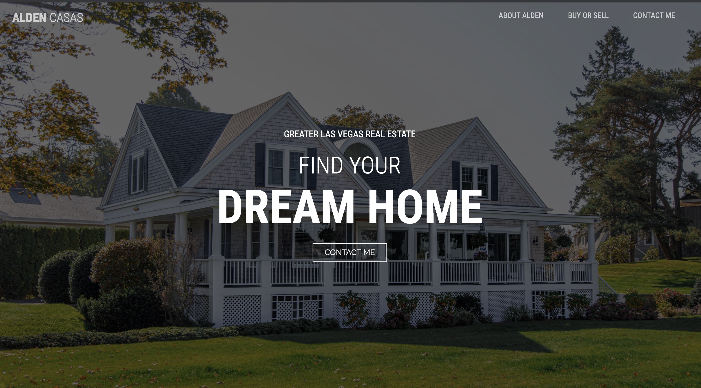

# The Alden Casas

> The Alden Casas is a website for a real estate company. Here clients can learn about the company story.

## Table of contents

- [General info](#general-info)
- [Screenshots](#screenshots)
- [Technologies](#technologies)
- [Setup](#setup)
- [Features](#features)
- [Status](#status)
- [Inspiration](#inspiration)
- [Contact](#contact)

## General info

The Alden Casas is made of three parts, i.e., About Alden, Buy or Sell and Contact Me.

## Screenshots

## Technologies

- Bootstrap - version 4.5
- Javascript - ES6

## Setup

_no extra actions_

## Code Examples

Show examples of usage:
`<body class="bg-primary"><header class="hero">
<h1>Aldencasas</h1><nav><ul><li><a href="#alden">ABOUT ALDEN</a></li><li><a href="#purchase">BUY OR SELL</a></li><li><a href="#contact">CONTACT ME</a></li></ul></nav>
`

## Features

List of features ready and TODOs for future development

- Transparent navbar
- Review slides

## Status

Project is: _done_.

## Inspiration

Add here credits. An interview Project inspired by MGL Agency.

## Contact

Created by [@Eva](https://www.facebook.com/profile.php?id=100042321316185) - feel free to contact me!
